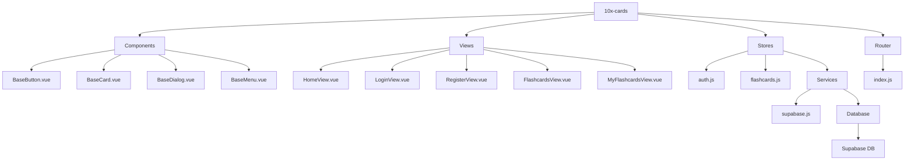
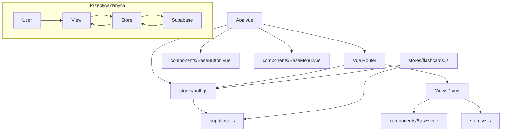

# Informacje o projekcie 10x-cards

## Struktura komponentów i zależności

### Struktura ASCII

```
+---------------------------------------------------------------------+
|                          10x-cards (Vue.js)                          |
+---------------------------------------------------------------------+
                                |
                +---------------+---------------+
                |                               |
    +-----------v-----------+     +-------------v-------------+
    |      Components       |     |          Views            |
    +-----------------------+     +---------------------------+
    | BaseButton.vue        |     | HomeView.vue              |
    | BaseCard.vue          |     | LoginView.vue             |
    | BaseDialog.vue        |     | RegisterView.vue          |
    | BaseMenu.vue          |     | FlashcardsView.vue        |
    +-----------+-----------+     | MyFlashcardsView.vue      |
                |                 +-------------+-------------+
                |                               |
                |                               |
    +-----------v-----------+     +-------------v-------------+
    |        Stores         |     |       Router              |
    +-----------------------+     +---------------------------+
    | auth.js               <-----+ index.js                  |
    | flashcards.js         |     |                           |
    +-----------+-----------+     +---------------------------+
                |
                |
    +-----------v-----------+
    |        Services       |
    +-----------------------+
    | supabase.js           |
    +-----------------------+
                |
                |
    +-----------v-----------+
    |        Database       |
    +-----------------------+
    |     Supabase DB       |
    |  (flashcards table)   |
    +-----------------------+
```

### Diagram Mermaid



## Struktura zależności



## Opis projektu

Aplikacja 10x-cards jest zbudowana w oparciu o Vue.js i służy jako system fiszek do nauki. Główne elementy architektury obejmują:

1. **Komponenty bazowe** (BaseButton, BaseCard, BaseDialog, BaseMenu) - wielokrotnie używane w widokach
2. **Widoki** (HomeView, LoginView, RegisterView, FlashcardsView, MyFlashcardsView) - główne strony aplikacji
3. **Store'y** (auth.js, flashcards.js) - zarządzanie stanem aplikacji przy użyciu Pinia
4. **Serwisy** (supabase.js) - integracja z bazą danych Supabase
5. **Router** - nawigacja między widokami z zabezpieczeniem tras wymagających autoryzacji

Aplikacja umożliwia użytkownikom rejestrację, logowanie, tworzenie własnych fiszek oraz przeprowadzanie sesji nauki.

## Technologie

- **Frontend**: Vue.js 3, Vue Router, Pinia, Tailwind CSS
- **Backend**: Supabase (autoryzacja, baza danych)
- **Testy**: Playwright (e2e), Vitest (unit)
- **Tooling**: Vite, PostCSS

## Struktura folderów

```
src/
  ├── App.vue                # Główny komponent aplikacji
  ├── main.js                # Punkt wejściowy aplikacji
  ├── supabase.js            # Konfiguracja Supabase
  ├── assets/                # Zasoby statyczne (CSS, obrazy)
  ├── components/            # Komponenty wielokrotnego użytku
  ├── composables/           # Kompozycyjne funkcje Vue
  ├── router/                # Konfiguracja routera
  ├── services/              # Serwisy do komunikacji z API
  ├── stores/                # Magazyny stanu (Pinia)
  └── views/                 # Widoki (strony) aplikacji
```